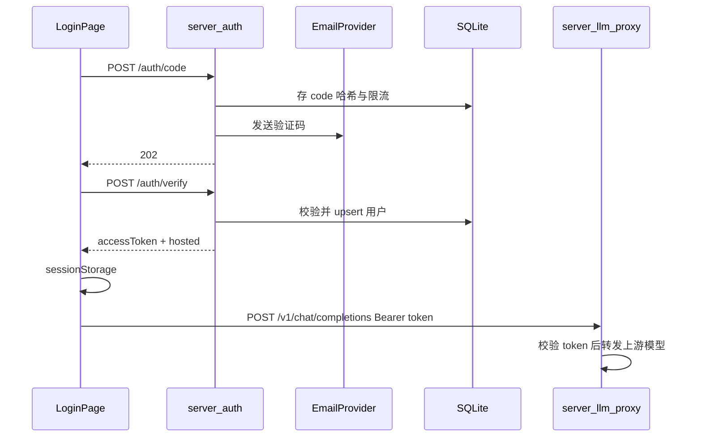

# Plan01-Real · 真实验证码注册 / 登录

> **总状态：✅ 已完成（A + B + D）** — 汇总见 [PLAN01.md](./PLAN01.md)（2026-08-08）。
>
> 目标：把当前前端 stub（测试码 `123456`）替换为**可本地跑通的真实鉴权链路**：发码 → 校验 → 注册或登录 → 签发 hosted 凭证 → Assistant 使用。
>
> 前置：Plan01 stub 已完成（[`LoginPage`](./src/pages/LoginPage.tsx)、[`authApi.ts`](./src/lib/authApi.ts)、[`auth.ts`](./src/state/auth.ts)）。
>
> 风格：与 [`PLAN.md`](./PLAN.md) 同级的可执行里程碑；按 A → B → C 顺序做，做完打勾。

---

## 已拍板决策（执行时不要再分叉）

| 项 | 决定 |
|---|---|
| 身份标识 | **邮箱优先**（手机短信放 C 阶段） |
| 注册形态 | **验证码即注册**：首次 `verify` 自动建用户，无需单独注册页 |
| 后端位置 | 仓库内 `server/auth/`（Node ESM，对齐现有 `server/compile/`） |
| 数据存储 MVP | 本地 SQLite（`server/auth/data/auth.sqlite`）；勿提交到 git |
| 验证码 | 6 位数字；哈希存储；5 分钟过期；一次性；60s 发送冷却；同邮箱 1h 最多 5 次 |
| 发码通道 A | **开发模式写日志 / 控制台**（不依赖第三方，保证本机可测） |
| 发码通道 B | Resend 或 SMTP（环境变量配置） |
| 会话策略 | 前端继续 `sessionStorage`（浏览器关闭需重新登录）；服务端发 `accessToken`（JWT 或随机 token，24h） |
| Hosted 凭证 | **不直接下发全局 OpenAI Key**；返回 `{ baseUrl: 代理地址, apiKey: 用户 accessToken, model }` |
| 前端改动面 | 主要替换 [`src/lib/authApi.ts`](./src/lib/authApi.ts)；UI 去掉 stubHint；其余尽量不动 |
| CORS | 开发期允许 Vite origin（如 `http://localhost:5173`） |

---

## 总流程



---

## 阶段 A · 本机可跑通（必须先做）

### 目标
不接真实邮件商也能完整演示：发码（打日志）→ 输码 → 登录 → 拿到 hosted → Assistant 经代理调用（可用 mock upstream 或真实 upstream）。

### A1 · 后端骨架

**目录**

```
server/auth/
  package.json
  index.mjs                 # HTTP 入口
  lib/
    db.mjs                  # SQLite 初始化与查询
    codes.mjs               # 生成 / 校验验证码
    tokens.mjs              # accessToken 签发与校验
    mail.mjs                # A: console；B: Resend/SMTP
    users.mjs               # upsert / find
  data/                     # gitignore
  .env.example
```

**根目录脚本**（写入 [`package.json`](./package.json)）

```json
"auth:server": "node server/auth/index.mjs"
```

**环境变量**（`.env.example`）

```bash
AUTH_PORT=8787
AUTH_JWT_SECRET=dev-change-me
AUTH_CODE_TTL_SEC=300
AUTH_CODE_COOLDOWN_SEC=60
MAIL_MODE=console          # console | resend | smtp
CORS_ORIGIN=http://localhost:5173
HOSTED_BASE_URL=http://localhost:8787/v1
HOSTED_DEFAULT_MODEL=gpt-4o-mini
# 上游模型（代理转发用；可后期再接）
UPSTREAM_BASE_URL=
UPSTREAM_API_KEY=
```

### A2 · HTTP 接口（固定契约）

#### `POST /auth/code`

请求：

```json
{ "contact": "user@example.com" }
```

规则：

- `contact` 必须是合法邮箱（A 阶段）
- 冷却 / 频控失败 → `429` + `{ "error": "rate_limited" }`
- 成功 → `202` + `{ "ok": true }`（**永不返回验证码正文**）
- `MAIL_MODE=console` 时把验证码打到服务端 stdout，便于开发复制

#### `POST /auth/verify`

请求：

```json
{ "contact": "user@example.com", "code": "482913" }
```

成功 `200`：

```json
{
  "ok": true,
  "user": { "id": "u_...", "email": "user@example.com", "displayName": "user" },
  "accessToken": "...",
  "hosted": {
    "baseUrl": "http://localhost:8787/v1",
    "apiKey": "<same-as-accessToken-or-derived>",
    "model": "gpt-4o-mini"
  }
}
```

失败：

| 情况 | HTTP | body |
|---|---|---|
| 验证码错误 / 过期 / 已用 | 401 | `{ "error": "invalid_code" }` |
| 邮箱非法 | 400 | `{ "error": "invalid_contact" }` |

语义：**首次成功 = 注册；再次成功 = 登录**（`users` 表 upsert）。

#### `GET /auth/me`（建议 A 阶段一并做）

- Header：`Authorization: Bearer <accessToken>`
- 200：用户信息 + hosted 摘要（可无 apiKey 明文重发，或重签短时 token）
- 401：无效 / 过期

#### `POST /auth/logout`（可选）

- 若用随机 token 表：删除服务端 token
- 若用无状态 JWT：A 阶段可仅靠前端 `clearAuth()`；B 阶段再加黑名单

### A3 · 数据表（SQLite）

```sql
CREATE TABLE users (
  id TEXT PRIMARY KEY,
  email TEXT NOT NULL UNIQUE,
  display_name TEXT NOT NULL,
  created_at TEXT NOT NULL,
  last_login_at TEXT
);

CREATE TABLE otp_codes (
  id TEXT PRIMARY KEY,
  email TEXT NOT NULL,
  code_hash TEXT NOT NULL,
  expires_at TEXT NOT NULL,
  consumed_at TEXT,
  created_at TEXT NOT NULL
);

CREATE TABLE access_tokens (
  token_hash TEXT PRIMARY KEY,
  user_id TEXT NOT NULL,
  expires_at TEXT NOT NULL,
  created_at TEXT NOT NULL
);

CREATE TABLE otp_send_log (
  id TEXT PRIMARY KEY,
  email TEXT NOT NULL,
  sent_at TEXT NOT NULL
);
```

### A4 · 前端接线

| 文件 | 改动 |
|---|---|
| [`src/lib/authApi.ts`](./src/lib/authApi.ts) | `requestCode` / `verifyCode` 改为 `fetch(VITE_AUTH_BASE_URL + ...)`；删除 stubHint / 固定码 |
| [`src/pages/LoginPage.tsx`](./src/pages/LoginPage.tsx) | 成功发码文案改为「已发送到邮箱」；错误映射 `rate_limited` |
| [`src/state/auth.ts`](./src/state/auth.ts) | `signInWithCode` 可附带保存 `accessToken`（若与 hosted.apiKey 分离） |
| `.env` / `.env.example`（前端） | `VITE_AUTH_BASE_URL=http://localhost:8787` |
| i18n | 增加 `login.codeSentReal`、`login.rateLimited` 等 |

**兼容开关（建议）**

```ts
// authApi.ts
const USE_STUB = import.meta.env.VITE_AUTH_STUB === "1";
```

- 默认走真实后端；仅本地无后端时 `VITE_AUTH_STUB=1` 回退旧 stub，避免阻断他人开发。

### A5 · LLM 代理（与 hosted 对齐的最小版）

同进程或同端口挂载：

- `POST /v1/chat/completions`
- 校验 `Authorization: Bearer`
- 若配置了 `UPSTREAM_*`：转发上游并流式/非流式返回（A 阶段非 stream 即可）
- 若未配置上游：返回明确 JSON 错误（勿静默成功）

这样登录后 Assistant **无需再填 Key**，与 Plan01 hosted 路径一致。

### A6 · 阶段 A 验收清单

- [x] `npm run auth:server` 可启动，无第三方邮件账号也能测
- [x] 打开登录页 → 输入邮箱 → 获取验证码 → 终端可见 6 位码（实现完成；请本机冒烟）
- [x] 错误码被拒；正确码首次创建用户，再次登录不重复建号
- [x] 前端 `sessionStorage` 出现 authenticated + hosted
- [x] 注销后 Assistant 不再带旧 token
- [x] 浏览器完全退出后再开，需重新验证码登录（sessionStorage）
- [x] 访客 custom 路径不受影响
- [x] `VITE_AUTH_STUB=1` 仍可走旧 stub

> 上游模型本阶段刻意留空：`/v1/chat/completions` 在未配置 `UPSTREAM_*` 时返回 503 `upstream_not_configured`。

### A7 · 建议执行顺序（单人 1–2 天）

1. 建 `server/auth` + SQLite + `/auth/code` + `/auth/verify`
2. console 打码，用 curl 跑通
3. 改前端 `authApi` + env
4. 加 `/v1/chat/completions` 代理
5. 端到端：登录 → 进工作区 → 发一条 Assistant 消息
6. 补 i18n / 限流 / README 片段

---

## 阶段 B · 真实发信

### 目标
验证码发到用户邮箱，开发机与预发环境可用。

### 范围

- [`server/auth/lib/mail.mjs`](./server/auth/lib/mail.mjs)：`MAIL_MODE=resend`（优先）或 `smtp`
- 环境变量：`RESEND_API_KEY` + `MAIL_FROM`，或 `SMTP_URL`
- 邮件模板：纯文本即可（「您的 MedPrism 验证码是 ******，5 分钟内有效」）
- 生产关闭 console 回显验证码
- 文档：[`docs/auth-setup.md`](./docs/auth-setup.md)（安装、env、如何测）

### 验收

- [x] Resend 发信已接入（`MAIL_MODE=resend`）
- [x] 服务端默认不打印明文验证码（仅 `MAIL_DEBUG=1` 时打印）
- [x] 真实邮箱能收到验证码（已验收：gmail / fudan）
- [x] 频控与过期在真实网络下仍正确

---

## 阶段 C · 增强（按需）

| 项 | 说明 |
|---|---|
| 手机短信 | 阿里云 / 腾讯云 SMS；`contact` 支持 E.164；与邮箱共用 verify |
| httpOnly Cookie | 替换或补充 Bearer；降低 XSS 偷 token 风险 |
| Refresh token | 若以后要「记住登录」再做；与当前「重启需登录」可并存为选项 |
| 管理端吊销 | 用户列表 / 禁用账号 / 吊销 token |
| 审计日志 | 登录成功/失败、发码次数 |
| 单元测试 | codes / tokens / rate limit 纯函数测试 |

---

## 安全清单（全程遵守）

- [ ] 验证码只存哈希（如 SHA-256 + 每码随机 salt，或直接 HMAC）
- [ ] 验证码明文只出现在邮件 / 短信，不写进 API 响应、不进前端 toast
- [ ] HTTPS 生产部署；JWT/secret 不用默认值
- [ ] 全局 OpenAI Key 仅存在服务端 `UPSTREAM_API_KEY`
- [ ] 代理校验用户 token，再转发上游
- [ ] `data/*.sqlite`、`.env` 加入 `.gitignore`

---

## 与现有 Plan 的关系

| Plan | 关系 |
|---|---|
| Plan01 stub | 本文件的起点；A4 完成后 stub 降级为可选开关 |
| Plan3 Hosted | 本文件 A5 提供真实 hosted `baseUrl`+token |
| Plan7 compile server | 可并列运行（不同端口）；远期可合并网关，不阻塞本 Plan |
| 访客 custom | **不改**；仍走 localStorage Provider 弹窗 |

建议在 [`PLAN.md`](./PLAN.md) 推荐顺序中插入：

```
… → Plan01 stub（已完成）→ Plan01-Real A/B → …
```

---

## 非目标（本 Plan 不做）

- OAuth / 微信 / SSO
- 密码登录、找回密码
- 多租户组织账号
- 前端改版登录视觉（沿用现有 graphite-on-paper）
- 修改 Plan7 Tectonic 编译逻辑

---

## 完成定义

**A 完成** = ✅ 本机双进程下 OTP + auth 服务闭环。  
**B 完成** = ✅ 真实邮箱收件（Resend）。  
**C** = 按产品需要单项开工（短信等，未做）。  
**D 完成** = ✅ NewAPI 自动发 Key + refresh 快速登录。

---

## 阶段 D · NewAPI 自动发 Key + 免验证码刷新（✅ 已落地）

- 验证码通过后：`POST NewAPI /api/token/`（name=邮箱，quota=2000，永不过期）→ `POST /api/token/batch/keys` 取完整 key
- 返回 `hosted = { baseUrl: NEWAPI_PUBLIC_BASE_URL, apiKey }` 给前端自动配置
- 签发 `refreshToken`（localStorage）；`POST /auth/refresh` 免验证码取回同一把 key
- `NEWAPI_USER_ID` 必须为**数字**用户 ID（与访问令牌所属用户一致，当前为 `1`）

### 验收

- [x] 验证码登录后 NewAPI 出现以邮箱命名的令牌
- [x] 前端自动带上 `baseUrl` + `apiKey`，`/v1/models` 可用
- [x] 快速登录（refresh）取回同一把 key
- [x] 访客 custom 路径仍可用
